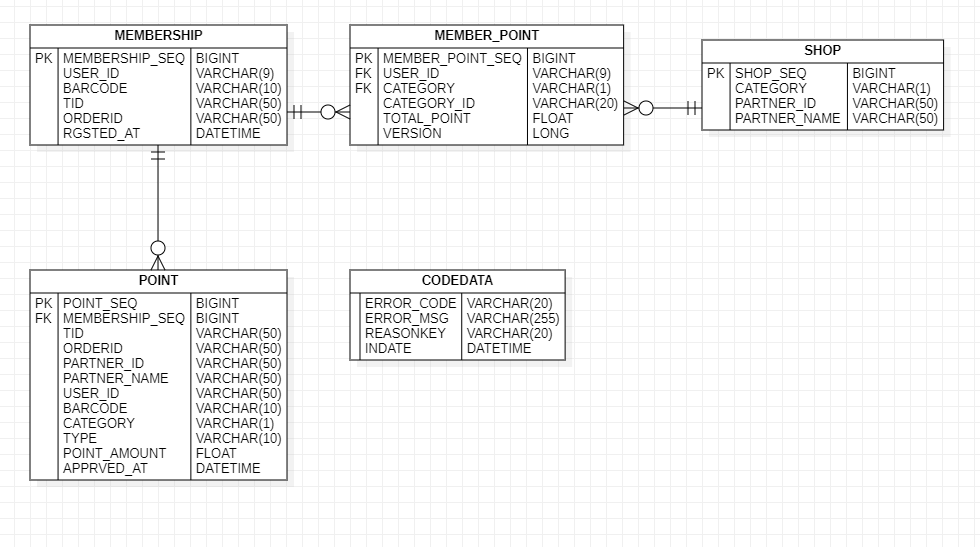

# 카카오페이 사전과제

# 프로젝트명 : KaKaoMemberShip

## 목적

- 카카오페이 멤버십 서비스 개발
    - 통합 바코드 API 개발
    - 포인트 적립 API 개발
    - 포인트 사용 API 개발
    - 기간별 내역 조회 API 개발

## 개발환경

- 언어 : JDK 11.0.13
- 프레임워크 : SpringBoot 2.5.6
- DB : H2(MySQL57InnoDBDialect)
- 빌드 툴: Maven 3.6.3

## 빌드 및 실행

- IntelliJ 로컬 환경에서 `KakaoMemberShipApplication` 실행 가능
- java -jar kakaopaymembership-1.0.0.jar 명령어로 빌드된 jar 파일 실행 가능

## Swagger 주소

- [http://localhost:8443/swagger-ui/index.html](http://localhost:8443/swagger-ui/index.html)

# 설계

## ERD 다이어그램



- MEMBERSHIP: 카카오 멤버십 정보 테이블
- SHOP: 상점 테이블
- POINT: 포인트 테이블
- CODEDATA: 응답코드 테이블
- MEMBER_POINT; 멤버 포인트 테이블
    - 사용자의 업종별 총 적립금 정보(CATEGORY, TOTAL_AMOUNT)

## API 명세

### 공통

- Content-Type: application/json; charset=UTF-8
- REST API
- 응답: json body 형태, returncode, returnmsg 포함
- 시간 형식 : `YYYY-MM-dd HH:mm:ss`
- *`TRANSACTION_ERROR`* (”99998”) 발생시에는 서버로 재시도 요청 필요

**요청 예시**

```json
{
    "user_id": 123456789,
    "order_id": "order_id"
}
```

**응답 예시**

```json
{
    "returncode": "00000",
    "returnmsg": "Api processing success",
    "membership_barcode": "2346233504",
    "tid": "220625093115894177",
    "order_id": "order_id",
    "registered_at": "2022-06-25 09:31:15"
}
```

### 정책

- 포인트
    - 금액은 float 타입으로 한다.
    - 소수점 금액도 처리 가능하나, 정수로 제한할 것을 권장
- 포인트 내역 조회
    - 시작기간, 종료기간은 일별(YYYYMMDD)로 조회 가능

## 통합 바코드 발급 API

- HTTP METHOD: **POST**
- URL : api/v1/membership/publish

**요청 파라미터**

| 필드명 | 타입 | 길이 | 설명 | 필수여부 |
| --- | --- | --- | --- | --- |
| user_id | Long | 9 | 사용자ID | 필수 |
| order_id | String | 50 | 주문ID | 필수 |

**응답 파라미터**

| 필드명 | 타입 | 길이 | 설명 | 필수여부 |
| --- | --- | --- | --- | --- |
| returncode | String | 5 | 응답코드 | 필수 |
| returnmsg | String | 255 | 응답메시지 | 필수 |
| membership_barcode | String | 10 | 멤버십 바코드 |  |
| registered_at | String | 20 | 등록시간 |  |
| tid | String | 50 | 거래ID |  |
| order_id | String | 50 | 주문ID |  |

## 포인트 적립 API

- HTTP METHOD: **POST**
- URL : api/v1/membership/point/earn

**요청 파라미터**

| 필드명 | 타입 | 길이 | 설명 | 필수여부 |
| --- | --- | --- | --- | --- |
| partner_id | String | 50 | 상점ID | 필수 |
| membership_barcode | String | 10 | 멤버십 바코드 | 필수 |
| point | Float | - | 적립금 | 필수 |
| order_id | String | 50 | 주문ID | 필수 |

**응답 파라미터**

| 필드명 | 타입 | 길이 | 설명 | 필수여부 |
| --- | --- | --- | --- | --- |
| returncode | String | 5 | 응답코드 | 필수 |
| returnmsg | String | 255 | 응답메시지 | 필수 |
| membership_barcode | String | 10 | 멤버십 바코드 |  |
| point | Float | - | 적립금 |  |
| approved_at | String | 20 | 승인시간 |  |
| tid | String | 50 | 거래ID |  |
| order_id | String | 50 | 주문ID |  |
| total_ point | Float | - | 총 적립금 |  |

## 포인트 사용 API

- HTTP METHOD: **POST**
- URL : api/v1/membership/point/use

**요청 파라미터**

| 필드명 | 타입 | 길이 | 설명 | 필수여부 |
| --- | --- | --- | --- | --- |
| partner_id | String | 50 | 상점ID | 필수 |
| membership_barcode | String | 10 | 멤버십 바코드 | 필수 |
| point | Float | - | 적립금 | 필수 |
| order_id | String | 50 | 주문ID | 필수 |

**응답 파라미터**

| 필드명 | 타입 | 길이 | 설명 | 필수여부 |
| --- | --- | --- | --- | --- |
| returncode | String | 5 | 응답코드 | 필수 |
| returnmsg | String | 255 | 응답메시지 | 필수 |
| membership_barcode | String | 10 | 멤버십 바코드 |  |
| point | Float | - | 적립금 |  |
| approved_at | String | 20 | 승인시간 |  |
| tid | String | 50 | 거래ID |  |
| order_id | String | 50 | 주문ID |  |
| total_ point | Float | - | 총 적립금 |  |

## 내역 조회 API

- HTTP METHOD: **GET**
- URL : api/v1/membership/point/history

**요청 파라미터**

| 필드명 | 타입 | 길이 | 설명 | 필수여부 |
| --- | --- | --- | --- | --- |
| membership_barcode | String | 10 | 멤버십 바코드 | 필수 |
| start_date | String | 8 | 시작기간(YYYYMMDD) | 필수 |
| end_date | String | 8 | 종료기간(YYYYMMDD) | 필수 |

**응답 파라미터**

| 필드명 | 타입 | 길이 | 설명 | 필수여부 |
| --- | --- | --- | --- | --- |
| returncode | String | 5 | 응답코드 | 필수 |
| returnmsg | String | 255 | 응답메시지 | 필수 |
| history | History Object Array | - | 사용내역 |  |

**History Object**

| 필드명 | 타입 | 길이 | 설명 |
| --- | --- | --- | --- |
| approved_at | String | 20 | 승인시간 |
| type | String | 10 | 적립유형 |
| category | String | 10 | 업종 |
| partner_name | String | 50 | 상점이름 |
| point | Float | - | 적립금 |

## 에러코드

| ERRORCODE | ERROR_MSG | DETAIL |
| --- | --- | --- |
| 00000 | Api processing success | 성공 |
| 00001 | Parameter is invalid | 파라미터 오류 |
| 00002 | User id already registered | 기등록 사용자ID |
| 00003 | Partner does not exist | 존재하지 않는 상점ID |
| 00004 | Barcode does not exist | 존재하지 않는 바코드 |
| 00005 | Remain point amount is not sufficient | 업종별 포인트 총 적립금 부족 |
| 00006 | There is no point history for requested barcode for requested dates | 요청한 바코드와 날짜의 사용내역이 존재하지 않음 |
| 99998 | Request transaction failed | 트랜잭션 실패 |
| 99999 | Api general error | API 내부 에러(기타) |

## 핵심 해결 전략

### 동시성 제어

- MySQL InnoDB 사용
    - 트랜잭션 격리 수준:  **REPEATABLE_READ**(InnoDB default)
    - InnoDB의 ****Next-Key Locking**** 에 의해 ********PHANTOM READ 방지

- 다중 사용자가 동일한 바코드로 동시에 포인트 적립/사용을 할 경우 → **낙관적 락** 사용
    - jpa commit 시점에 version을 확인하여 select시와 update시의 버전이 다른 경우 실패 처리한다.
- 예외 상황 발생시에는 **트랜잭션 실패 코드**(**99998**) 반환, 클라이언트 측에서 재시도 하도록 함
- 카프카 등의 Event Broker로 트랜잭션 실패시에는 재시도 처리하도록 하여야 함.

### 다중 서버 다중 인스턴스에 대한 고려

- **서버 로드밸런싱**(L4 레이어), Virtual IP 할당
- **애플리케이션 로드밸런**싱 : Spring Cloud LoadBalancer(eureka 사용) gateway 서버에서 다중 인스턴스 관리하도록 함
- **DB** : MSA를 따라 각 어플리케이션마다 DB 세팅, 동기화 필요
- **MASTER TABLE 관리:** MEMBER(계좌), MEMBER_POINT(적립금)에 대하여서는 실시간 동기화가 필요할 것으로 예상. POINT(사용내역)의 경우 Spring batch job을 이용하여 동기화
- **캐시** : ehcache를 사용하여 SHOP(상점), CODE_DATA(에러코드) 60초간 캐싱, 캐싱 동기화를 위해서는 Redis 사용할 필요가 있음.
- **락**: 낙관적 락 사용. JPA **@Version** 어노테이션으로 MEMBER_POINT(멤버 포인트) 수정시 버전 업데이트

→ 전반적으로 어플리케이션 단의 소스코드보다는 실제 서비스의 인프라 측면에서의 동시성 제어가 중요하다고 생각합니다.

### 트랜잭션

스프링부트 @Transactional 어노테이션을 사용하여 제어

- 서비스에서 Exception 발생시 롤백 처리
- 격리 수준 DEFAULT(REPEATABLE READ) : SELECT 중 SHARED LOCK이 걸리므로 다른 트랜잭션이 수정 불가
- 전파 레벨 : 트랜잭션 도중 실패 발생시 해당 트랜잭션 전부 롤백 처리

```java
@Transactional(isolation = Isolation.DEFAULT, propagation = Propagation.REQUIRED, rollbackFor = {Exception.class})
```

- 조회만 하는 경우 처리

```java
@Transactional(readOnly = true)
```

- 예시) 포인트 사용시 POINT 테이블에 INSERT 하고, MEMBER_POINT를 UPDATE 도중 Excetpion 발생시에는 POINT 롤백 처리됨
- 해당 내용은 JPA 영속성 매니저에서 캐시된 데이터가 COMMIT되기 이전에 발생하여 트랜잭션이 실패하더라도 DB에는 영향이 없음

### 락

- **낙관적 락 사용 이유** :사용자 멤버십을 가족 또는 친구와 공유하더라도, 트랜잭션 충돌이 자주 발생하지는 않을 것으로 가정
- 만약 동일한 바코드를 동시에 사용하는 경우가 많다면, 데이터 충돌이 우려되기 때문에 성능이 저하되더라도 비관적 락을 걸어야 할 수도 있음. → 상황 봐서 결정
- **트랜잭션 도중에 다른 사람이 먼저 업데이트를 진행하여 버전을 변경했을 경우**

→ **ObjectOptimisticLockingFailureException** 발생할 것

다중 서버를 사용 시에, 낙관적 락 사용시 트랜잭션 실패가 발생하면 **분산 락**을 사용하여 재시도 처리를 해 주어야 함 (Redis 사용)

### 캐시

- EhCache 적용

```xml
<cache-template name="myDefaultTemplate">
        <!--캐시 만료 시간 = timeToLiveSeconds -->
        <expiry>
            <ttl unit="seconds">60</ttl>
        </expiry>
        <!--JVM heap 메모리, LRU strategy -->
        <heap unit="entries">200</heap>
    </cache-template>
```

```java
public interface ShopRepository extends JpaRepository<Shop, String> {
    @Cacheable(value = "shop")
    Optional<Shop> findByPartnerId(String partnerId);
}
```

- 상점의 경우 API가 따로 없고, 설정값이라고 생각해서 60초간 캐싱해도 문제가 없을 것으로 예상
- 에러코드도 마찬가지
- POINT(사용내역), MEMBER_POINT(멤버포인트), MEMBERSHIP(멤버쉽)의 경우는 테이블 수정/삽입이 빈번하기 때문에 캐싱하지 않고 실시간 처리

### 예외 처리

```java
		SUCCESS("SUCCESS"), //성공 00000
    INVALID_PARAMETER("INVALID_PARAMETER"), //잘못된 파라미터 00001
    REGISTERED_ID("REGISTERED_ID"), // 기등록 USERID 00002
    NO_PARTNER("NO_PARTNER"), // 상점 존재 X 00003
    NO_BARCODE("NO_BARCODE"), // 바코드 존재 X 00004
    NOT_ENOUGH_POINT("NOT_ENOUGH_POINT"), // 잔액 부족 00005
    NO_POINT_HISTORY("NO_POINT_HISTORY"), // 포인트 내역 X 00005
    TRANSACTION_ERROR("TRANSACTION_ERROR"), // 트랜잭션 오류 99998
    API_GENERAL_ERROR("API_GENERAL_ERROR") //기타오류 99999
```

- enum 값으로 Exception 처리할 reasonKey(실패 및 성공사유) 세팅
- 응답시 해당 키에 매핑된 returncode와 returnmsg를 CODEDATA(에러코드) 테이블에서 조회하여 Dto 형태로 반환
- 응답코드를 DB에서 관리하기 때문에 사용자 응답시 일관성 있도록 처리 가능
- CODE_DATA에 없는 에러 발생시에는 기타오류(99999)로 처리

### 바코드 생성

- JAVA UUID로 10자리 랜덤값 생성
- 중복 값 생성시에는 MEMBERSHIP(멤버쉽) 테이블에 INSERT 시 *`TRANSACTION_ERROR`* 발생하여 실패 처리됨

## MEMBER_POINT 테이블 관련 설명

- 해당 테이블은 사용자의 업종별 통합 적립금을 관리하기 위한 테이블
- MEMBERSHIP 과 SHOP 테이블의 각각 USER_ID, CATEGORY를 FK로 가지며, 두 테이블의 관계를 설정한다.
- 포인트 적립에 있어 USER_ID(사용자ID)와 CATEGORY(업종)별로 구분하기 때문에 개별 상점의 포인트를 관리할 필요가 없고, 사용자의 업종별 포인트만 관리하면 된다고 판단하였음.
- 통합 적립금을 조회할 때, 매번 사용 내역에서 전부 조회하여 계산한다면, 다중 사용자가 적립과 사용할 반복할 시에 POINT 테이블에 SELECT를 너무 자주 하게 될 것이다.
- 따라서 매번 POINT 테이블에 적립/사용으로 INSERT할 때마다 MEMBER_POINT 테이블을 UPDATE하여 사용자의 업종별 통합 적립금(TOTAL_AMOUNT)를 관리하는 것이 낫다고 생각하였음.
- 사용자가 동일한 바코드로 동시에 적립/사용을 요청할 경우 UPDATE시에 락이 걸려서 총 적립금은 동시에 하나의 트랜잭션만이 UPDATE할 수 있음. 다른 트랜잭션은 롤백되기 때문에 MEMBER_POINT의 총 적립금(TOTAL_AMOUNT)과 POINT(사용 내역)의 POINT_AMOUNT 값을 합산한 것이 일치할 수 밖에 없다.
- 이 경우 실패한 트랜잭션은 클라이언트 측(Event Broker)에서 재시도 요청해야 한다.
- 결제 관련 서비스에서는 **데이터 정합성** 측면에서 **계좌의 총 금액과 사용 내역의 금액을 합친 것이 일치하지 않으면 문제가 발생할 수 있다**고 생각하여, 성능 이슈가 발생하더라도 이렇게 하는 것이 옳다고 판단하였음.
- MEMBER_POINT 테이블에는 MEMBERSHIP 테이블의 UNIQUE값인 USER_ID 하나당 업종의 개수(3개)가 존재할 수 있음.
- **동일한 바코드와 업종으로 포인트 적립/사용 요청이 왔을 경우:**
    - ****JPA 영속성 매니저에서 POINT(사용 내역)을 먼저 1차 캐시에 저장하고, MEMBER_POINT를 저장한다.
    - MEMBER_POINT의 PK인 MEMBER_POINT_SEQ 값이 이미 저장되어 있으면 UPDATE
    - 만약 해당 USER_ID와 CATEGORY가 MEMBER_POINT에 저장되어 있지 않으면 INSERT
    - COMMIT으로 DB에 반영
    - 도중에 Exception 발생시에는 트랜잭션을 **롤백**하고 트랜잭션 에러를 반환한다.

## 추가 파라미터 설명

- **TID(거래ID)** : 서버 측에서 생성한 트랜잭션 고유 ID, 각 요청을 식별하기 위한 값으로 에러 발생시 로그 확인이나, DB 내역을 조회하기 위해 사용
- **ORDERID(주문ID)** : 클라이언트측에서 발송한 고유 ID: 클라이언트가 보낸 요청을 식별하기 위한 값. 클라이언트 측 요청이 중간이 유실되었을 경우, TID를 응답으로 받지 못하기 때문에 ORDERID로 대체하여 해당 요청 식별 가능

### TID 생성

요청에 대해 동일한 TID가 반환되지 않도록(멀티 쓰레드 환경)

TID 생성시에 lock을 걸어 동기화 처리

# 테스트

- JUnit 테스트 : test 클래스에 작성
- 동시성 테스트 : curl로 동시호출

## 1. 통합 바코드 발급 테스트

### **JUnit 테스트**

**PublishControllerTest**

| 테스트명 | 응답코드 | 테스트 결과 |
| --- | --- | --- |
| 바코드 발급 테스트(user_id 길이 실패) | 00001 | 성공 |
| 바코드 발급 테스트(성공) | 00000 | 성공 |
| 바코드 중복 발급 테스트 | 00002 | 성공 |

### 동시성 **테스트**

- 동시에 10개의 바코드 발급 요청
- curl & 사용

```powershell
curl -kv -X POST "http://localhost:8443/api/v1/membership/publish" -H "Content-Type: application/json" -d"{ """user_id""": 123456789, """order_id""": """order_id"""}" & curl -kv -X POST "http://localhost:8443/api/v1/membership/publish" -H "Content-Type: application/json" -d"{ """user_id""": 123456781, """order_id""": """order_id"""}" & curl -kv -X POST "http://localhost:8443/api/v1/membership/publish" -H "Content-Type: application/json" -d"{ """user_id""": 123456782, """order_id""": """order_id"""}" & curl -kv -X POST "http://localhost:8443/api/v1/membership/publish" -H "Content-Type: application/json" -d"{ """user_id""": 123456783, """order_id""": """order_id"""}" & curl -kv -X POST "http://localhost:8443/api/v1/membership/publish" -H "Content-Type: application/json" -d"{ """user_id""": 123456784, """order_id""": """order_id"""}" & curl -kv -X POST "http://localhost:8443/api/v1/membership/publish" -H "Content-Type: application/json" -d"{ """user_id""": 123456785, """order_id""": """order_id"""}" & curl -kv -X POST "http://localhost:8443/api/v1/membership/publish" -H "Content-Type: application/json" -d"{ """user_id""": 123456786, """order_id""": """order_id"""}" & curl -kv -X POST "http://localhost:8443/api/v1/membership/publish" -H "Content-Type: application/json" -d"{ """user_id""": 123456787, """order_id""": """order_id"""}" & curl -kv -X POST "http://localhost:8443/api/v1/membership/publish" -H "Content-Type: application/json" -d"{ """user_id""": 123456788, """order_id""": """order_id"""}" & curl -kv -X POST "http://localhost:8443/api/v1/membership/publish" -H "Content-Type: application/json" -d"{ """user_id""": 123456789, """order_id""": """order_id"""}"
```

| user_id | membership_barcode | tid | 응답코드 | 테스트 결과 |
| --- | --- | --- | --- | --- |
| 123456789 | 2272137455 | 220625122443105177 | 00000 | 성공 |
| 123456781 | 2265231786 | 220625122443389277 | 00000 | 성공 |
| 123456782 | 2156423607 | 220625122443481377 | 00000 | 성공 |
| 123456783 | 2310836351 | 220625122443583477 | 00000 | 성공 |
| 123456784 | 2386881770 | 220625122443689577 | 00000 | 성공 |
| 123456785 | 2076504362 | 220625122443795677 | 00000 | 성공 |
| 123456786 | 4340048666 | 220625122443914777 | 00000 | 성공 |
| 123456787 | 4224083716 | 220625122444031877 | 00000 | 성공 |
| 123456788 | 2311265036 | 220625122444146977 | 00000 | 성공 |
| 123456789 | 2272137455 | 220625122443105177 | 00001 | 성공 |
- 바코드 중복 x , tid 중복 x

→ **이상 없음**

[publish.txt](README/publish.txt)

## 2. 포인트 적립 테스트

### **JUnit 테스트**

**PointControllerTest**

| 테스트명 | 응답코드 | 테스트 결과 |
| --- | --- | --- |
| 포인트 적립 실패 테스트(바코드 길이 실패) | 00001 | 성공 |
| 포인트 적립 실패 테스트(상점 ID 존재 X) | 00003 | 성공 |
| 포인트 적립 실패 테스트(바코드 존재 X) | 00004 | 성공 |
| 포인트 적립 성공 테스트 | 00000 | 성공 |

### 동시성 **테스트**

- 동시에 10개의 포인트 적립 요청
- curl & 사용

```powershell
curl -kv -X POST "http://localhost:8443/api/v1/membership/point/earn" -H "Content-Type: application/json" -d"{ """partner_id""": """cosmetics2""", """membership_barcode""": """ABCDEFGHIJ""", """point""": 100, """order_id""": """order_id"""}" & curl -kv -X POST "http://localhost:8443/api/v1/membership/point/earn" -H "Content-Type: application/json" -d"{ """partner_id""": """cosmetics2""", """membership_barcode""": """ABCDEFGHIJ""", """point""": 100, """order_id""": """order_id"""}" &curl -kv -X POST "http://localhost:8443/api/v1/membership/point/earn" -H "Content-Type: application/json" -d"{ """partner_id""": """cosmetics2""", """membership_barcode""": """ABCDEFGHIJ""", """point""": 100, """order_id""": """order_id"""}" &curl -kv -X POST "http://localhost:8443/api/v1/membership/point/earn" -H "Content-Type: application/json" -d"{ """partner_id""": """cosmetics2""", """membership_barcode""": """ABCDEFGHIJ""", """point""": 100, """order_id""": """order_id"""}" &curl -kv -X POST "http://localhost:8443/api/v1/membership/point/earn" -H "Content-Type: application/json" -d"{ """partner_id""": """cosmetics2""", """membership_barcode""": """ABCDEFGHIJ""", """point""": 100, """order_id""": """order_id"""}" &curl -kv -X POST "http://localhost:8443/api/v1/membership/point/earn" -H "Content-Type: application/json" -d"{ """partner_id""": """cosmetics2""", """membership_barcode""": """ABCDEFGHIJ""", """point""": 100, """order_id""": """order_id"""}" &curl -kv -X POST "http://localhost:8443/api/v1/membership/point/earn" -H "Content-Type: application/json" -d"{ """partner_id""": """cosmetics2""", """membership_barcode""": """ABCDEFGHIJ""", """point""": 100, """order_id""": """order_id"""}" &curl -kv -X POST "http://localhost:8443/api/v1/membership/point/earn" -H "Content-Type: application/json" -d"{ """partner_id""": """cosmetics2""", """membership_barcode""": """ABCDEFGHIJ""", """point""": 100, """order_id""": """order_id"""}" &curl -kv -X POST "http://localhost:8443/api/v1/membership/point/earn" -H "Content-Type: application/json" -d"{ """partner_id""": """cosmetics2""", """membership_barcode""": """ABCDEFGHIJ""", """point""": 100, """order_id""": """order_id"""}" &curl -kv -X POST "http://localhost:8443/api/v1/membership/point/earn" -H "Content-Type: application/json" -d"{ """partner_id""": """cosmetics2""", """membership_barcode""": """ABCDEFGHIJ""", """point""": 100, """order_id""": """order_id"""}"
```

| user_id | total_point | tid | 응답코드 | 테스트 결과 |
| --- | --- | --- | --- | --- |
| ABCDEFGHIJ | 100 | 220625125638824177 | 00000 | 성공 |
| ABCDEFGHIJ | 200 | 220625125639114277 | 00000 | 성공 |
| ABCDEFGHIJ | 300 | 220625125639227377 | 00000 | 성공 |
| ABCDEFGHIJ | 400 | 220625125639344477 | 00000 | 성공 |
| ABCDEFGHIJ | 500 | 220625125639459577 | 00000 | 성공 |
| ABCDEFGHIJ | 600 | 220625125639561677 | 00000 | 성공 |
| ABCDEFGHIJ | 700 | 220625125639666777 | 00000 | 성공 |
| ABCDEFGHIJ | 800 | 220625125639772877 | 00000 | 성공 |
| ABCDEFGHIJ | 900 | 220625125639881977 | 00000 | 성공 |
| ABCDEFGHIJ | 1000 | 220625125639988077 | 00000 | 성공 |
- 100원씩 10회 → 적립금 1000원 성공

→ **이상 없음**

[earn.txt](README/earn.txt)

- 서로 다른 상점ID로 포인트 적립 요청(업종별 통합 적립금 테스트)

```powershell
curl -kv -X POST "http://localhost:8443/api/v1/membership/point/earn" -H "Content-Type: application/json" -d"{ """partner_id""": """cosmetics1""", """membership_barcode""": """ABCDEFGHIJ""", """point""": 100, """order_id""": """order_id"""}" & curl -kv -X POST "http://localhost:8443/api/v1/membership/point/earn" -H "Content-Type: application/json" -d"{ """partner_id""": """cosmetics2""", """membership_barcode""": """ABCDEFGHIJ""", """point""": 100, """order_id""": """order_id"""}" &curl -kv -X POST "http://localhost:8443/api/v1/membership/point/earn" -H "Content-Type: application/json" -d"{ """partner_id""": """grocery1""", """membership_barcode""": """ABCDEFGHIJ""", """point""": 100, """order_id""": """order_id"""}" &curl -kv -X POST "http://localhost:8443/api/v1/membership/point/earn" -H "Content-Type: application/json" -d"{ """partner_id""": """grocery2""", """membership_barcode""": """ABCDEFGHIJ""", """point""": 100, """order_id""": """order_id"""}" &curl -kv -X POST "http://localhost:8443/api/v1/membership/point/earn" -H "Content-Type: application/json" -d"{ """partner_id""": """cosmetics2""", """membership_barcode""": """ABCDEFGHIJ""", """point""": 100, """order_id""": """order_id"""}" &curl -kv -X POST "http://localhost:8443/api/v1/membership/point/earn" -H "Content-Type: application/json" -d"{ """partner_id""": """restaurant1""", """membership_barcode""": """ABCDEFGHIJ""", """point""": 100, """order_id""": """order_id"""}" &curl -kv -X POST "http://localhost:8443/api/v1/membership/point/earn" -H "Content-Type: application/json" -d"{ """partner_id""": """restaurant2""", """membership_barcode""": """ABCDEFGHIJ""", """point""": 100, """order_id""": """order_id"""}" &curl -kv -X POST "http://localhost:8443/api/v1/membership/point/earn" -H "Content-Type: application/json" -d"{ """partner_id""": """cosmetics1""", """membership_barcode""": """ABCDEFGHIJ""", """point""": 100, """order_id""": """order_id"""}" &curl -kv -X POST "http://localhost:8443/api/v1/membership/point/earn" -H "Content-Type: application/json" -d"{ """partner_id""": """cosmetics2""", """membership_barcode""": """ABCDEFGHIJ""", """point""": 100, """order_id""": """order_id"""}" &curl -kv -X POST "http://localhost:8443/api/v1/membership/point/earn" -H "Content-Type: application/json" -d"{ """partner_id""": """grocery1""", """membership_barcode""": """ABCDEFGHIJ""", """point""": 100, """order_id""": """order_id"""}"
```

| user_id | category | partner_id | total_point | 응답코드 | 테스트 결과 |
| --- | --- | --- | --- | --- | --- |
| ABCDEFGHIJ | B | cosmetics1 | 100 | 00000 | 성공 |
| ABCDEFGHIJ | B | cosmetics2 | 200 | 00000 | 성공 |
| ABCDEFGHIJ | A | grocery1 | 100 | 00000 | 성공 |
| ABCDEFGHIJ | A | grocery2 | 200 | 00000 | 성공 |
| ABCDEFGHIJ | B | cosmetics2 | 300 | 00000 | 성공 |
| ABCDEFGHIJ | C | restaurant1 | 100 | 00000 | 성공 |
| ABCDEFGHIJ | C | restaurant2 | 200 | 00000 | 성공 |
| ABCDEFGHIJ | B | cosmetics1 | 400 | 00000 | 성공 |
| ABCDEFGHIJ | B | cosmetics2 | 500 | 00000 | 성공 |
| ABCDEFGHIJ | A | grocery1 | 300 | 00001 | 성공 |
- partner_id에 할당된 업종별로 통합 적립금이 쌓이는 것을 확인

→ **이상 없음**

[earn2.txt](README/earn2.txt)

## 3. 포인트 사용 테스트

### **JUnit 테스트**

**PointControllerTest**

| 테스트명 | 응답코드 | 테스트 결과 |
| --- | --- | --- |
| 포인트 사용 실패 테스트(바코드 길이 실패) | 00001 | 성공 |
| 포인트 사용 실패 테스트(상점 ID 존재 X) | 00003 | 성공 |
| 포인트 사용 실패 테스트(바코드 존재 X) | 00004 | 성공 |
| 포인트 사용 실패 테스트(적립 내역 없음) | 00005 | 성공 |
| 포인트 사용 실패 테스트(적립 금액 초과) | 00005 | 성공 |
| 포인트 사용 성공 테스트 | 00000 | 성공 |

### 동시성 **테스트**

- 동시에 10개의 포인트 사용 요청(data.sql 사용하여 샘플값 insert)

```sql
-- 사용내역 --
INSERT INTO POINT (POINT_SEQ, MEMBERSHIP_SEQ, TID, ORDERID, PARTNER_ID, PARTNER_NAME, USER_ID, BARCODE, CATEGORY, TYPE, POINT_AMOUNT) VALUES ('100000', '100000', 'TESTTID',
'TESTORDERID', 'testshop', '테스트상점', '200000000', 'ABCDEFGHIJ', 'A', 'earn', '1000');

-- 멤버십포인트 --
INSERT INTO MEMBER_POINT (MEMBER_POINT_SEQ, USER_ID, CATEGORY, CATEGORY_ID, TOTAL_POINT, VERSION) VALUES ('100000', '200000000', 1, 'GROCERY', '1000', '1');
```

- curl & 사용

```powershell
curl -kv -X POST "http://localhost:8443/api/v1/membership/point/use" -H "Content-Type: application/json" -d"{ """partner_id""": """testshop""", """membership_barcode""": """ABCDEFGHIJ""", """point""": 100, """order_id""": """order_id"""} &
curl -kv -X POST "http://localhost:8443/api/v1/membership/point/use" -H "Content-Type: application/json" -d"{ """partner_id""": """testshop""", """membership_barcode""": """ABCDEFGHIJ""", """point""": 100, """order_id""": """order_id"""} &
curl -kv -X POST "http://localhost:8443/api/v1/membership/point/use" -H "Content-Type: application/json" -d"{ """partner_id""": """testshop""", """membership_barcode""": """ABCDEFGHIJ""", """point""": 100, """order_id""": """order_id"""} &
curl -kv -X POST "http://localhost:8443/api/v1/membership/point/use" -H "Content-Type: application/json" -d"{ """partner_id""": """testshop""", """membership_barcode""": """ABCDEFGHIJ""", """point""": 100, """order_id""": """order_id"""} &
curl -kv -X POST "http://localhost:8443/api/v1/membership/point/use" -H "Content-Type: application/json" -d"{ """partner_id""": """testshop""", """membership_barcode""": """ABCDEFGHIJ""", """point""": 100, """order_id""": """order_id"""} &
curl -kv -X POST "http://localhost:8443/api/v1/membership/point/use" -H "Content-Type: application/json" -d"{ """partner_id""": """testshop""", """membership_barcode""": """ABCDEFGHIJ""", """point""": 100, """order_id""": """order_id"""} &
curl -kv -X POST "http://localhost:8443/api/v1/membership/point/use" -H "Content-Type: application/json" -d"{ """partner_id""": """testshop""", """membership_barcode""": """ABCDEFGHIJ""", """point""": 100, """order_id""": """order_id"""} &
curl -kv -X POST "http://localhost:8443/api/v1/membership/point/use" -H "Content-Type: application/json" -d"{ """partner_id""": """testshop""", """membership_barcode""": """ABCDEFGHIJ""", """point""": 100, """order_id""": """order_id"""} &
curl -kv -X POST "http://localhost:8443/api/v1/membership/point/use" -H "Content-Type: application/json" -d"{ """partner_id""": """testshop""", """membership_barcode""": """ABCDEFGHIJ""", """point""": 100, """order_id""": """order_id"""} &
curl -kv -X POST "http://localhost:8443/api/v1/membership/point/use" -H "Content-Type: application/json" -d"{ """partner_id""": """testshop""", """membership_barcode""": """ABCDEFGHIJ""", """point""": 100, """order_id""": """order_id"""}
```

| user_id | total_point | tid | 응답코드 | 테스트 결과 |
| --- | --- | --- | --- | --- |
| ABCDEFGHIJ | 900 | 220625142301950177 | 00000 | 성공 |
| ABCDEFGHIJ | 800 | 220625142302252277 | 00000 | 성공 |
| ABCDEFGHIJ | 700 | 220625142302346377 | 00000 | 성공 |
| ABCDEFGHIJ | 600 | 220625142302453477 | 00000 | 성공 |
| ABCDEFGHIJ | 500 | 220625142302574577 | 00000 | 성공 |
| ABCDEFGHIJ | 400 | 220625142302696677 | 00000 | 성공 |
| ABCDEFGHIJ | 300 | 220625142302813777 | 00000 | 성공 |
| ABCDEFGHIJ | 200 | 220625142302934877 | 00000 | 성공 |
| ABCDEFGHIJ | 100 | 220625142303055977 | 00000 | 성공 |
| ABCDEFGHIJ | 0 | 220625142303606077 | 00000 | 성공 |
- 100원씩 10회 → 적립금 1000원 성공

→ **이상 없음**

[use.txt](README/use.txt)

- 서로 다른 상점ID로 포인트 사용 및 적립 요청(업종별 통합 적립금 테스트)

```powershell
curl -kv -X POST "http://localhost:8443/api/v1/membership/point/earn" -H "Content-Type: application/json" -d"{ """partner_id""": """cosmetics1""", """membership_barcode""": """ABCDEFGHIJ""", """point""": 100, """order_id""": """order_id"""}" & curl -kv -X POST "http://localhost:8443/api/v1/membership/point/earn" -H "Content-Type: application/json" -d"{ """partner_id""": """cosmetics2""", """membership_barcode""": """ABCDEFGHIJ""", """point""": 100, """order_id""": """order_id"""}" &curl -kv -X POST "http://localhost:8443/api/v1/membership/point/earn" -H "Content-Type: application/json" -d"{ """partner_id""": """grocery1""", """membership_barcode""": """ABCDEFGHIJ""", """point""": 100, """order_id""": """order_id"""}" &curl -kv -X POST "http://localhost:8443/api/v1/membership/point/earn" -H "Content-Type: application/json" -d"{ """partner_id""": """grocery2""", """membership_barcode""": """ABCDEFGHIJ""", """point""": 100, """order_id""": """order_id"""}" &curl -kv -X POST "http://localhost:8443/api/v1/membership/point/earn" -H "Content-Type: application/json" -d"{ """partner_id""": """cosmetics2""", """membership_barcode""": """ABCDEFGHIJ""", """point""": 100, """order_id""": """order_id"""}" &curl -kv -X POST "http://localhost:8443/api/v1/membership/point/earn" -H "Content-Type: application/json" -d"{ """partner_id""": """restaurant1""", """membership_barcode""": """ABCDEFGHIJ""", """point""": 100, """order_id""": """order_id"""}" &curl -kv -X POST "http://localhost:8443/api/v1/membership/point/earn" -H "Content-Type: application/json" -d"{ """partner_id""": """restaurant2""", """membership_barcode""": """ABCDEFGHIJ""", """point""": 100, """order_id""": """order_id"""}" &curl -kv -X POST "http://localhost:8443/api/v1/membership/point/use" -H "Content-Type: application/json" -d"{ """partner_id""": """cosmetics1""", """membership_barcode""": """ABCDEFGHIJ""", """point""": 100, """order_id""": """order_id"""}" &curl -kv -X POST "http://localhost:8443/api/v1/membership/point/use" -H "Content-Type: application/json" -d"{ """partner_id""": """cosmetics2""", """membership_barcode""": """ABCDEFGHIJ""", """point""": 100, """order_id""": """order_id"""}" &curl -kv -X POST "http://localhost:8443/api/v1/membership/point/use" -H "Content-Type: application/json" -d"{ """partner_id""": """grocery1""", """membership_barcode""": """ABCDEFGHIJ""", """point""": 100, """order_id""": """order_id"""}"
```

| user_id | category | type | partner_id | total_point | 응답코드 | 테스트 결과 |
| --- | --- | --- | --- | --- | --- | --- |
| ABCDEFGHIJ | B | earn | cosmetics1 | 100 | 00000 | 성공 |
| ABCDEFGHIJ | B | earn | cosmetics2 | 200 | 00000 | 성공 |
| ABCDEFGHIJ | A | earn | grocery1 | 1100 | 00000 | 성공 |
| ABCDEFGHIJ | A | earn | grocery2 | 1200 | 00000 | 성공 |
| ABCDEFGHIJ | B | earn | cosmetics2 | 300 | 00000 | 성공 |
| ABCDEFGHIJ | C | earn | restaurant1 | 100 | 00000 | 성공 |
| ABCDEFGHIJ | C | earn | restaurant2 | 200 | 00000 | 성공 |
| ABCDEFGHIJ | B | use | cosmetics1 | 200 | 00000 | 성공 |
| ABCDEFGHIJ | B | use | cosmetics2 | 100 | 00000 | 성공 |
| ABCDEFGHIJ | A | use | grocery1 | 1100 | 00001 | 성공 |
- partner_id에 할당된 업종별로 통합 적립금이 증감되는 것을 확인

→ 이상 없음

[use2.txt](README/use2.txt)

## 4. 내역 조회 테스트

### **JUnit 테스트**

**HistoryControllerTest**

| 테스트명 | 응답코드 | 테스트 결과 |
| --- | --- | --- |
| 사용 내역 조회 테스트(파라미터 길이) | 00001 | 성공 |
| 사용 내역 조회 테스트(날짜형식) | 00001 | 성공 |
| "사용 내역 조회 테스트(성공) | 00000 | 성공 |

### 동시성 **테스트**

- 동시에 100개의 내역 요청
- curl & 사용

```powershell
curl -kv "http://localhost:8443/api/v1/membership/point/history?membership_barcode=ABCDEFGHIJ&start_date=20220625&end_date=20220625" & 
curl -kv "http://localhost:8443/api/v1/membership/point/history?membership_barcode=ABCDEFGHIJ&start_date=20220625&end_date=20220625" & 
curl -kv "http://localhost:8443/api/v1/membership/point/history?membership_barcode=ABCDEFGHIJ&start_date=20220625&end_date=20220625" & 
curl -kv "http://localhost:8443/api/v1/membership/point/history?membership_barcode=ABCDEFGHIJ&start_date=20220625&end_date=20220625" & 
curl -kv "http://localhost:8443/api/v1/membership/point/history?membership_barcode=ABCDEFGHIJ&start_date=20220625&end_date=20220625" & 
curl -kv "http://localhost:8443/api/v1/membership/point/history?membership_barcode=ABCDEFGHIJ&start_date=20220625&end_date=20220625" & 
curl -kv "http://localhost:8443/api/v1/membership/point/history?membership_barcode=ABCDEFGHIJ&start_date=20220625&end_date=20220625" & 
curl -kv "http://localhost:8443/api/v1/membership/point/history?membership_barcode=ABCDEFGHIJ&start_date=20220625&end_date=20220625" & 
curl -kv "http://localhost:8443/api/v1/membership/point/history?membership_barcode=ABCDEFGHIJ&start_date=20220625&end_date=20220625" & 
curl -kv "http://localhost:8443/api/v1/membership/point/history?membership_barcode=ABCDEFGHIJ&start_date=20220625&end_date=20220625" & curl -kv "http://localhost:8443/api/v1/membership/point/history?membership_barcode=ABCDEFGHIJ&start_date=20220625&end_date=20220625" & 
curl -kv "http://localhost:8443/api/v1/membership/point/history?membership_barcode=ABCDEFGHIJ&start_date=20220625&end_date=20220625" & 
curl -kv "http://localhost:8443/api/v1/membership/point/history?membership_barcode=ABCDEFGHIJ&start_date=20220625&end_date=20220625" & 
curl -kv "http://localhost:8443/api/v1/membership/point/history?membership_barcode=ABCDEFGHIJ&start_date=20220625&end_date=20220625" & 
curl -kv "http://localhost:8443/api/v1/membership/point/history?membership_barcode=ABCDEFGHIJ&start_date=20220625&end_date=20220625" & 
curl -kv "http://localhost:8443/api/v1/membership/point/history?membership_barcode=ABCDEFGHIJ&start_date=20220625&end_date=20220625" & 
curl -kv "http://localhost:8443/api/v1/membership/point/history?membership_barcode=ABCDEFGHIJ&start_date=20220625&end_date=20220625" & 
curl -kv "http://localhost:8443/api/v1/membership/point/history?membership_barcode=ABCDEFGHIJ&start_date=20220625&end_date=20220625" & 
curl -kv "http://localhost:8443/api/v1/membership/point/history?membership_barcode=ABCDEFGHIJ&start_date=20220625&end_date=20220625" & 
curl -kv "http://localhost:8443/api/v1/membership/point/history?membership_barcode=ABCDEFGHIJ&start_date=20220625&end_date=20220625" & curl -kv "http://localhost:8443/api/v1/membership/point/history?membership_barcode=ABCDEFGHIJ&start_date=20220625&end_date=20220625" & 
curl -kv "http://localhost:8443/api/v1/membership/point/history?membership_barcode=ABCDEFGHIJ&start_date=20220625&end_date=20220625" & 
curl -kv "http://localhost:8443/api/v1/membership/point/history?membership_barcode=ABCDEFGHIJ&start_date=20220625&end_date=20220625" & 
curl -kv "http://localhost:8443/api/v1/membership/point/history?membership_barcode=ABCDEFGHIJ&start_date=20220625&end_date=20220625" & 
curl -kv "http://localhost:8443/api/v1/membership/point/history?membership_barcode=ABCDEFGHIJ&start_date=20220625&end_date=20220625" & 
curl -kv "http://localhost:8443/api/v1/membership/point/history?membership_barcode=ABCDEFGHIJ&start_date=20220625&end_date=20220625" & 
curl -kv "http://localhost:8443/api/v1/membership/point/history?membership_barcode=ABCDEFGHIJ&start_date=20220625&end_date=20220625" & 
curl -kv "http://localhost:8443/api/v1/membership/point/history?membership_barcode=ABCDEFGHIJ&start_date=20220625&end_date=20220625" & 
curl -kv "http://localhost:8443/api/v1/membership/point/history?membership_barcode=ABCDEFGHIJ&start_date=20220625&end_date=20220625" & 
curl -kv "http://localhost:8443/api/v1/membership/point/history?membership_barcode=ABCDEFGHIJ&start_date=20220625&end_date=20220625" & curl -kv "http://localhost:8443/api/v1/membership/point/history?membership_barcode=ABCDEFGHIJ&start_date=20220625&end_date=20220625" & 
curl -kv "http://localhost:8443/api/v1/membership/point/history?membership_barcode=ABCDEFGHIJ&start_date=20220625&end_date=20220625" & 
curl -kv "http://localhost:8443/api/v1/membership/point/history?membership_barcode=ABCDEFGHIJ&start_date=20220625&end_date=20220625" & 
curl -kv "http://localhost:8443/api/v1/membership/point/history?membership_barcode=ABCDEFGHIJ&start_date=20220625&end_date=20220625" & 
curl -kv "http://localhost:8443/api/v1/membership/point/history?membership_barcode=ABCDEFGHIJ&start_date=20220625&end_date=20220625" & 
curl -kv "http://localhost:8443/api/v1/membership/point/history?membership_barcode=ABCDEFGHIJ&start_date=20220625&end_date=20220625" & 
curl -kv "http://localhost:8443/api/v1/membership/point/history?membership_barcode=ABCDEFGHIJ&start_date=20220625&end_date=20220625" & 
curl -kv "http://localhost:8443/api/v1/membership/point/history?membership_barcode=ABCDEFGHIJ&start_date=20220625&end_date=20220625" & 
curl -kv "http://localhost:8443/api/v1/membership/point/history?membership_barcode=ABCDEFGHIJ&start_date=20220625&end_date=20220625" & 
curl -kv "http://localhost:8443/api/v1/membership/point/history?membership_barcode=ABCDEFGHIJ&start_date=20220625&end_date=20220625" & curl -kv "http://localhost:8443/api/v1/membership/point/history?membership_barcode=ABCDEFGHIJ&start_date=20220625&end_date=20220625" & 
curl -kv "http://localhost:8443/api/v1/membership/point/history?membership_barcode=ABCDEFGHIJ&start_date=20220625&end_date=20220625" & 
curl -kv "http://localhost:8443/api/v1/membership/point/history?membership_barcode=ABCDEFGHIJ&start_date=20220625&end_date=20220625" & 
curl -kv "http://localhost:8443/api/v1/membership/point/history?membership_barcode=ABCDEFGHIJ&start_date=20220625&end_date=20220625" & 
curl -kv "http://localhost:8443/api/v1/membership/point/history?membership_barcode=ABCDEFGHIJ&start_date=20220625&end_date=20220625" & 
curl -kv "http://localhost:8443/api/v1/membership/point/history?membership_barcode=ABCDEFGHIJ&start_date=20220625&end_date=20220625" & 
curl -kv "http://localhost:8443/api/v1/membership/point/history?membership_barcode=ABCDEFGHIJ&start_date=20220625&end_date=20220625" & 
curl -kv "http://localhost:8443/api/v1/membership/point/history?membership_barcode=ABCDEFGHIJ&start_date=20220625&end_date=20220625" & 
curl -kv "http://localhost:8443/api/v1/membership/point/history?membership_barcode=ABCDEFGHIJ&start_date=20220625&end_date=20220625" & 
curl -kv "http://localhost:8443/api/v1/membership/point/history?membership_barcode=ABCDEFGHIJ&start_date=20220625&end_date=20220625" & curl -kv "http://localhost:8443/api/v1/membership/point/history?membership_barcode=ABCDEFGHIJ&start_date=20220625&end_date=20220625" & 
curl -kv "http://localhost:8443/api/v1/membership/point/history?membership_barcode=ABCDEFGHIJ&start_date=20220625&end_date=20220625" & 
curl -kv "http://localhost:8443/api/v1/membership/point/history?membership_barcode=ABCDEFGHIJ&start_date=20220625&end_date=20220625" & 
curl -kv "http://localhost:8443/api/v1/membership/point/history?membership_barcode=ABCDEFGHIJ&start_date=20220625&end_date=20220625" & 
curl -kv "http://localhost:8443/api/v1/membership/point/history?membership_barcode=ABCDEFGHIJ&start_date=20220625&end_date=20220625" & 
curl -kv "http://localhost:8443/api/v1/membership/point/history?membership_barcode=ABCDEFGHIJ&start_date=20220625&end_date=20220625" & 
curl -kv "http://localhost:8443/api/v1/membership/point/history?membership_barcode=ABCDEFGHIJ&start_date=20220625&end_date=20220625" & 
curl -kv "http://localhost:8443/api/v1/membership/point/history?membership_barcode=ABCDEFGHIJ&start_date=20220625&end_date=20220625" & 
curl -kv "http://localhost:8443/api/v1/membership/point/history?membership_barcode=ABCDEFGHIJ&start_date=20220625&end_date=20220625" & 
curl -kv "http://localhost:8443/api/v1/membership/point/history?membership_barcode=ABCDEFGHIJ&start_date=20220625&end_date=20220625" & curl -kv "http://localhost:8443/api/v1/membership/point/history?membership_barcode=ABCDEFGHIJ&start_date=20220625&end_date=20220625" & 
curl -kv "http://localhost:8443/api/v1/membership/point/history?membership_barcode=ABCDEFGHIJ&start_date=20220625&end_date=20220625" & 
curl -kv "http://localhost:8443/api/v1/membership/point/history?membership_barcode=ABCDEFGHIJ&start_date=20220625&end_date=20220625" & 
curl -kv "http://localhost:8443/api/v1/membership/point/history?membership_barcode=ABCDEFGHIJ&start_date=20220625&end_date=20220625" & 
curl -kv "http://localhost:8443/api/v1/membership/point/history?membership_barcode=ABCDEFGHIJ&start_date=20220625&end_date=20220625" & 
curl -kv "http://localhost:8443/api/v1/membership/point/history?membership_barcode=ABCDEFGHIJ&start_date=20220625&end_date=20220625" & 
curl -kv "http://localhost:8443/api/v1/membership/point/history?membership_barcode=ABCDEFGHIJ&start_date=20220625&end_date=20220625" & 
curl -kv "http://localhost:8443/api/v1/membership/point/history?membership_barcode=ABCDEFGHIJ&start_date=20220625&end_date=20220625" & 
curl -kv "http://localhost:8443/api/v1/membership/point/history?membership_barcode=ABCDEFGHIJ&start_date=20220625&end_date=20220625" & 
curl -kv "http://localhost:8443/api/v1/membership/point/history?membership_barcode=ABCDEFGHIJ&start_date=20220625&end_date=20220625" & curl -kv "http://localhost:8443/api/v1/membership/point/history?membership_barcode=ABCDEFGHIJ&start_date=20220625&end_date=20220625" & 
curl -kv "http://localhost:8443/api/v1/membership/point/history?membership_barcode=ABCDEFGHIJ&start_date=20220625&end_date=20220625" & 
curl -kv "http://localhost:8443/api/v1/membership/point/history?membership_barcode=ABCDEFGHIJ&start_date=20220625&end_date=20220625" & 
curl -kv "http://localhost:8443/api/v1/membership/point/history?membership_barcode=ABCDEFGHIJ&start_date=20220625&end_date=20220625" & 
curl -kv "http://localhost:8443/api/v1/membership/point/history?membership_barcode=ABCDEFGHIJ&start_date=20220625&end_date=20220625" & 
curl -kv "http://localhost:8443/api/v1/membership/point/history?membership_barcode=ABCDEFGHIJ&start_date=20220625&end_date=20220625" & 
curl -kv "http://localhost:8443/api/v1/membership/point/history?membership_barcode=ABCDEFGHIJ&start_date=20220625&end_date=20220625" & 
curl -kv "http://localhost:8443/api/v1/membership/point/history?membership_barcode=ABCDEFGHIJ&start_date=20220625&end_date=20220625" & 
curl -kv "http://localhost:8443/api/v1/membership/point/history?membership_barcode=ABCDEFGHIJ&start_date=20220625&end_date=20220625" & 
curl -kv "http://localhost:8443/api/v1/membership/point/history?membership_barcode=ABCDEFGHIJ&start_date=20220625&end_date=20220625" & curl -kv "http://localhost:8443/api/v1/membership/point/history?membership_barcode=ABCDEFGHIJ&start_date=20220625&end_date=20220625" & 
curl -kv "http://localhost:8443/api/v1/membership/point/history?membership_barcode=ABCDEFGHIJ&start_date=20220625&end_date=20220625" & 
curl -kv "http://localhost:8443/api/v1/membership/point/history?membership_barcode=ABCDEFGHIJ&start_date=20220625&end_date=20220625" & 
curl -kv "http://localhost:8443/api/v1/membership/point/history?membership_barcode=ABCDEFGHIJ&start_date=20220625&end_date=20220625" & 
curl -kv "http://localhost:8443/api/v1/membership/point/history?membership_barcode=ABCDEFGHIJ&start_date=20220625&end_date=20220625" & 
curl -kv "http://localhost:8443/api/v1/membership/point/history?membership_barcode=ABCDEFGHIJ&start_date=20220625&end_date=20220625" & 
curl -kv "http://localhost:8443/api/v1/membership/point/history?membership_barcode=ABCDEFGHIJ&start_date=20220625&end_date=20220625" & 
curl -kv "http://localhost:8443/api/v1/membership/point/history?membership_barcode=ABCDEFGHIJ&start_date=20220625&end_date=20220625" & 
curl -kv "http://localhost:8443/api/v1/membership/point/history?membership_barcode=ABCDEFGHIJ&start_date=20220625&end_date=20220625" & 
curl -kv "http://localhost:8443/api/v1/membership/point/history?membership_barcode=ABCDEFGHIJ&start_date=20220625&end_date=20220625" & curl -kv "http://localhost:8443/api/v1/membership/point/history?membership_barcode=ABCDEFGHIJ&start_date=20220625&end_date=20220625" & 
curl -kv "http://localhost:8443/api/v1/membership/point/history?membership_barcode=ABCDEFGHIJ&start_date=20220625&end_date=20220625" & 
curl -kv "http://localhost:8443/api/v1/membership/point/history?membership_barcode=ABCDEFGHIJ&start_date=20220625&end_date=20220625" & 
curl -kv "http://localhost:8443/api/v1/membership/point/history?membership_barcode=ABCDEFGHIJ&start_date=20220625&end_date=20220625" & 
curl -kv "http://localhost:8443/api/v1/membership/point/history?membership_barcode=ABCDEFGHIJ&start_date=20220625&end_date=20220625" & 
curl -kv "http://localhost:8443/api/v1/membership/point/history?membership_barcode=ABCDEFGHIJ&start_date=20220625&end_date=20220625" & 
curl -kv "http://localhost:8443/api/v1/membership/point/history?membership_barcode=ABCDEFGHIJ&start_date=20220625&end_date=20220625" & 
curl -kv "http://localhost:8443/api/v1/membership/point/history?membership_barcode=ABCDEFGHIJ&start_date=20220625&end_date=20220625" & 
curl -kv "http://localhost:8443/api/v1/membership/point/history?membership_barcode=ABCDEFGHIJ&start_date=20220625&end_date=20220625" & 
curl -kv "http://localhost:8443/api/v1/membership/point/history?membership_barcode=ABCDEFGHIJ&start_date=20220625&end_date=20220625"
```

**→ 전부 성공**

[Untitled](README/Untitled.txt)

# Swagger 사용 테스트

### Swagger를 이용한 테스트 방법

1. 통합 바코드 발급 API로 바코드 발급 호출
2. 응답으로 받은 바코드로 포인트 사용/적립 호출
3. 사용 내역에서 바코드와 사용일 호출

### Swagger 사용 예시

- 통합 바코드 발급


- 포인트 적립


- 포인트 사용


- 사용 내역 조회


### Postman 컬렉션

[Untitled](README/Untitled.json)